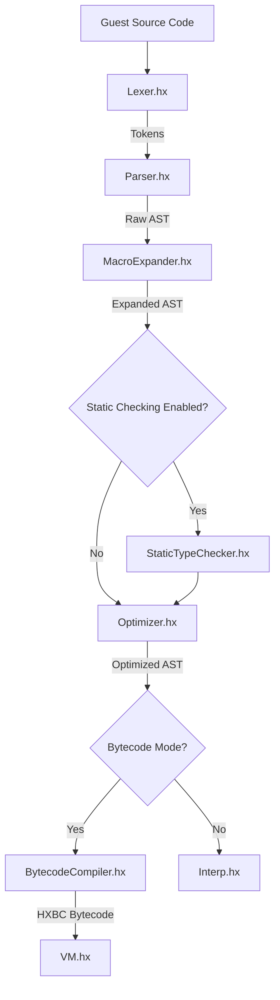

# Haxiom

Haxiom is a secure, sandboxed Haxe-in-Haxe scripting engine and bytecode Virtual Machine (VM). It allows you to parse, compile, optimize, and execute Haxe script code safely at runtime. 

Haxiom is designed for game engines, host applications, and modding frameworks that need a high-performance, sandboxed scripting layer with robust type-checking, Ahead-of-Time (AOT) compilation, and compact serialization.

> [!IMPORTANT]
> Haxiom is currently a developer preview. It's stable enough to experiment with and for learning. However, the API may change in the future.

---

## Key Features

- **Haxe-in-Haxe Parsing & Interpretation**: A custom Lexer and Parser that tokenizes and builds Haxe AST representation, which can be run directly using the AST Interpreter (`useVM = false`).
- **Register Bytecode VM**: Compiles the AST into register VM bytecode instructions (HXBC format) and runs them in a high-speed execution loop (`useVM = true`), achieving **up to 1,200x speedups** over direct AST interpretation.
- **Dead Code Elimination (DCE)**: Prunes dead private class methods/fields, unreachable statements after interrupts (`return`, `throw`, `break`), and unused pure local variables to minimize payload sizes.
- **Peephole & Bytecode Optimizations**: Discards redundant `OP_DUP` + `OP_POP` or `OP_GET_LOCAL` + `OP_POP` statements, and converts conditional or fall-through jumps targeting adjacent code blocks into simple `OP_POP`/NOP operations.
- **Static Type Checking**: Includes an opt-in static type checking phase during compilation to strictly validate variables, generics (class and enum generics), typedef structures, and collections.
- **Foreign Function Interface (FFI)**: Expose host variables, instances, native classes, and namespaces to guest scripts with access safety locks. Supports compile-time automated package exposure via macros.
- **Enhanced VM Pooling**: Recycles stack arrays, call frames, and scopes in the virtual machine execution loop, minimizing runtime garbage collection overhead.
- **Ahead-of-Time (AOT) Method Compilation**: Methods compile AOT directly into bytecode chunks while setting their AST representations to `null` to conserve constant pool payload space, falling back to VM execution transparently at runtime.
- **Compact AST Binary Serializer**: Compresses Haxe expressions into serialized binary payloads utilizing ZigZag varint compression and local string pools.
- **Execution Safeguards**: Limit guest execution with an instruction/operation budget (`maxInstructions`) to block infinite loops and resource consumption.

---

## Installation

Add Haxiom to your Haxe project via `haxelib`.

```bash
haxelib git haxiom https://github.com/Igazine/haxiom.git
```

Include it in your Haxe compile options (`build.hxml`) using the library flag:

```hxml
-L haxiom
```

---

## Basic Usage

### 1. Simple Interpretation (AST Mode)

Execute a script dynamically using direct AST evaluation:

```haxe
import haxiom.Haxiom;

class Main {
    static function main() {
        var engine = new Haxiom();
        engine.useVM = false; // Run in direct AST evaluation mode
        
        var result = engine.interpret("
            var greeting = 'Hello, ' + 'World!';
            return greeting;
        ");
        
        trace(result); // Hello, World!
    }
}
```

### 2. Compiled VM Execution (HXBC Mode)

Compile a Haxe script to bytecode and execute it via the high-performance Virtual Machine:

```haxe
import haxiom.Haxiom;

class Main {
    static function main() {
        var engine = new Haxiom();
        engine.useVM = true; // Enable the Bytecode VM
        
        var script = "
            function fib(n) {
                if (n <= 1) return n;
                return fib(n - 1) + fib(n - 2);
            }
            return fib(10);
        ";
        
        var result = engine.interpret(script);
        trace(result); // 55
    }
}
```

### 3. FFI: Exposing Host Components

Expose native Haxe classes or functions to guest script environments:

```haxe
import haxiom.Haxiom;

class Main {
    static function main() {
        var engine = new Haxiom();
        
        // Expose a native value or utility function
        engine.setGlobal("myHostVal", 42);
        engine.setGlobal("multiply", function(x:Int, y:Int):Int {
            return x * y;
        });
        
        var result = engine.interpret("
            return multiply(myHostVal, 2);
        ");
        
        trace(result); // 84
    }
}
```

### 4. Compile-Time FFI Package Auto-Registration

Expose entire host library packages (e.g., `openfl.display.*`, `feathers.controls.*`) dynamically without writing manual class mappings:

* **In compiler build configuration (`build.hxml`)**:
  ```hxml
  --macro haxiom.macro.FFIMacro.exposePackage("openfl.display")
  ```

* **In host startup code**:
  ```haxe
  import haxiom.FFI;
  import haxiom.Haxiom;

  var engine = new Haxiom();
  // Automatically resolves and registers all classes in exposed packages at runtime
  FFI.registerExposedClasses(engine);
  ```

---

## Language Support & Syntax Matrix

Haxiom supports most core Haxe language elements with specific limitations to keep its footprint small:

### Supported Syntax
* **Single-Quoted String Interpolation**: Standard `'hello ${name}'` interpolation.
* **Comprehensions**: Array `[for (i in 0...10) i]` and Map `[for (i in 0...5) i => 'num ${i}']` comprehensions.
* **Rest Arguments**: Prefix `...args:Dynamic` syntax mapped to native array slices.
* **Finals**: local variables (`final x`), class instance fields, and static fields. Mutability is strictly checked at compilation and runtime.
* **Strict Semicolons**: Semicolons are required on statement-level expressions and declarations, using standard Haxe exemptions (e.g. compound constructs, last expression in a block).
* **Regular Expressions**: Native support for Haxe's `~/pattern/flags` regex literals, including escaped delimiters `\/` and flags. Auto-whitelisted `EReg` class, allowing guest scripts to call standard Haxe regex matching (`match()`, `matched()`, etc.) directly.
* **Class-Path Enum Constructors**: Refer to enum constructors using their qualified name (e.g., `Color.Red` or `pack.enums.Color.Red`), short constructors (e.g., `Red` when imported), and parameterized enum case mapping.
* **Abstract Implicit Casting**: Safe, automatic conversion between abstract types and their underlying types (implicit `from`/`to` casts) during assignments, argument passing, and returns.

### Literals & Operators
* **Supported**: Hexadecimal (`0xFF`) / binary (`0b10`) integer literals, scientific Floats (`2.1e5`), boolean literals, range iterator (`1...3`), null-coalescing (`??`), and safe navigation/optional chaining (`obj?.field`).
* **Not Supported**:
  * Standalone floating-point notation without decimal trailing digits (e.g. `3.` parses as integer `3` and dot token; write `3.0` instead).
  * Compile-time character code evaluation (e.g. `"A".code` returns `null`; use `"A".charCodeAt(0)`).
  * Bitwise compound assignments (`<<=`, `>>=`, etc.).

---

## Integration & Architectural Patterns

### 1. IDE-Friendly Host Interop (`#if !haxiom_script` dummy scope)
To write scripts utilizing host-injected globals inside an IDE without producing Language Server errors, wrap dummy host class declarations in your script with `#if !haxiom_script`:
```haxe
#if !haxiom_script
class ScriptContext {
    public static var container:Dynamic;
}
#end

class Demo {
    static public function main() {
        trace("LSP-safe container access: " + ScriptContext.container);
    }
}
```

### 2. Automatic Entry Point Routing
If a script defines a class with a static `main()` method (meeting standard Haxe classpath conventions), Haxiom's parser preprocessor detects it and automatically appends a routing call (`MyScript.main()`) to the evaluation AST block.

### 3. Safe Sandboxing (Proxy Pattern)
Due to Haxe's dynamic reflection lookup, passing native visual objects (e.g., `Sprite`) directly to scripts allows scripts to access unmapped/dangerous parent fields like `.parent` or `.stage`. We recommend wrapping native objects in minimalist proxy adapters before exposing them as globals.

### 4. Sequential Execution vs Clean Slate
A single `Haxiom` instance can be executed sequentially to reuse state. Classes, globals, and FFI setups from a previous execution run are preserved, minimizing GC overhead. For untrusted code, instantiate a clean `Haxiom` instance.

### 5. Direct Closure Extraction
Host Haxe applications can resolve and call script-defined functions directly. Guest methods (up to 4 arguments) are wrapped as standard closures, allowing hosts to fetch them via `engine.interpret("ClassName.methodName")` and invoke them natively.

### 6. Modular Scripting & Dependency Loading
Set the `moduleResolver` callback to load imports (`import helper.MathUtils;`) dynamically from local assets. 
* *Asynchronous browser environments*: Asynchronously pre-fetch dependencies into a cache map before running the script, or scan the AST for imports (`EImport`) and fetch them in parallel prior to VM execution.

### 7. Navigating Haxe DCE (Dead Code Elimination)
Haxe DCE strips classes not explicitly referenced at host compilation time. To prevent classes or methods referenced dynamically by guest scripts from being stripped:
- Annotate native host classes with `@:keep`.
- Force package retention in build configurations: `--macro include("openfl.events", true)`.
- Or disable DCE entirely via `-dce no`.

### 8. Erased Static Inline Variables
Haxe replaces inline constants (like `MouseEvent.CLICK`) with literal values during compile-time. To make these erased constants accessible to guest scripts, `FFI.registerClass` is implemented as a compile-time macro that parses and retains their literal bindings dynamically.

### 9. Platform-Agnostic Instruction Safeguards
Protect applications from infinite loops by setting `engine.maxInstructions`. The engine counts operation nodes (AST) or instruction cycles (VM) and aborts with a callstack trace on threshold breach. This check is instruction-based, making it **100% deterministic and platform-independent**.

### 10. Asynchronous Script Execution (Fibers)
Haxiom supports non-blocking asynchronous script execution utilizing user-land cooperative fibers. Any guest function or closure that calls `Haxiom.await(future)` is implicitly compiled as an asynchronous chunk.

* **Implicit Async Detection**: The compiler automatically scans the AST of function/closure bodies. If it detects a `Haxiom.await` call, it compiles the chunk as async (returning a promise-like `Future` when evaluated) without requiring any custom compiler keywords or `@:haxiom.async` metadata.
* **Non-Blocking Yielding**: When executing `Haxiom.await` on a pending future, the virtual machine pauses execution, suspends the `VMFiber` state (stack, call frames, scopes), and returns immediately, allowing the host application's event loop to continue running. When resolved, the fiber is scheduled to resume exactly where it was paused.

---

## Performance Benchmark

Benchmarks compiled to JavaScript and executed on the V8 Engine (`Node.js`) highlight the massive performance advantages of compiling scripts to the Haxiom Virtual Machine:

| Benchmark | AST Interpreter Time | VM Time (No Pooling) | VM Time (With Pooling) | VM Speedup |
| :--- | :--- | :--- | :--- | :--- |
| **Recursive Fibonacci (`fib(12)`)** | 49,193ms | 38ms | 42ms | **~1,200x** |
| **Inner Closures (2,000 steps)** | 74,192ms | 496ms | 238ms | **~310x** |
| **Try/Catch Resolution (1,000 steps)** | 39,742ms | 2,377ms | 2,403ms | **~16x** |

*Pooling* enables the recycling of activation frames, significantly accelerating heavy closure and scope instantiation patterns.

---

## Architecture Overview

Haxiom compiles scripts through a modular pipeline:



- **[AST.hx](src/haxiom/AST.hx)**: Defines the Haxe syntax tree structures and enums.
- **[Interp.hx](src/haxiom/Interp.hx)**: The interpreter that directly runs AST expressions or routes AOT bytecode methods to the VM.
- **[VM.hx](src/haxiom/VM.hx)**: The Virtual Machine execution engine running stack and register instructions.
- **[StaticTypeChecker.hx](src/haxiom/StaticTypeChecker.hx)**: An opt-in compiler pass verifying types before execution.
- **[Optimizer.hx](src/haxiom/Optimizer.hx)**: Handles constant-folding and dead code elimination.

---

## Verification & Testing

Verify your modifications before contributing. Run the Haxiom verification test suite:

```bash
haxe build.hxml
```

All test scripts should report `SUCCESS` and finish with `ALL TESTS COMPLETED SUCCESSFULLY!`.
